# LinkedIn Intelligence System


An automated n8n workflow that analyzes your LinkedIn data monthly, generates strategic insights using AI, and delivers actionable recommendations to improve your professional profile.

## 🏗️ System Architecture

```mermaid
flowchart LR
    A["Monthly Schedule
    1st @ 9:00 AM"] --> B["Google Drive List"]
    A --> C["Get GitHub Repos"]

    B --> D{"Diff Check
    New File?"}
    D -->|Yes| E["Download Export"]
    E --> F["Decompress ZIP"]
    F --> G["Filter CSVs"]
    G --> H["Read CSV Files"]

    H --> I["Merge LinkedIn
    + GitHub Data"]
    C --> I

    I --> J["Data Merger
    Format for AI"]
    J --> K["AI Analysis
    Gemini 1.5 Flash"]
    K --> L["Convert to HTML"]
    L --> M["Send Email Report"]
    M --> N["Delete Processed File"]

    style A fill:#d5e8d4,stroke:#82b366
    style B fill:#dae8fc,stroke:#6c8ebf
    style C fill:#f8cecc,stroke:#b85450
    style D fill:#fff2cc,stroke:#d6b656
    style E fill:#dae8fc,stroke:#6c8ebf
    style I fill:#e1d5e7,stroke:#9673a6
    style K fill:#f5f5f5,stroke:#666666
    style M fill:#d5e8d4,stroke:#82b366
    style N fill:#f8cecc,stroke:#b85450
```



The system follows a modern microservices-like architecture with clear separation of concerns:

- **Trigger Layer**: Automated monthly schedule (1st of each month at 9:00 AM)
- **Data Sources**: Google Drive (LinkedIn exports) + GitHub API (repository data)
- **Processing Pipeline**: Extract → Filter → Parse → Merge
- **AI Analysis**: Google Gemini 1.5 Flash (1M Token Context)
- **Output**: HTML report generation and email delivery
- **Cleanup**: Automatic file deletion post-processing

## 📋 Table of Contents

- [📖 Overview](#overview)
- [✨ Features](#features)
- [✅ Prerequisites](#prerequisites)
- [🚀 Quick Start](#quick-start)
- [⚙️ Setup Instructions](#setup-instructions)
- [🏗️ Workflow Architecture](#workflow-architecture)
- [▶️ Execution Methods](#execution-methods)
- [🛠️ Troubleshooting](#troubleshooting)
- [📅 Maintenance](#maintenance)

---

## 📖 Overview

This system automatically:

- Fetches LinkedIn export data from Google Drive
- Analyzes your GitHub repositories
- Generates AI-powered insights using Google Gemini 1.5 Flash (1M Token Context)
- Delivers monthly strategic reports via email
- Provides actionable recommendations for profile optimization

---

## ✨ Features

### 🎯 Automated Monthly Analysis

- Runs on the 1st of every month at 9:00 AM
- Processes LinkedIn export ZIP files from Google Drive
- Cross-references with GitHub activity

### 🔍 Comprehensive Auditing

- **Red Flag Detection**: Identifies keyword gaps, stagnation, and outdated skills
- **15-Point Scorecard**: Evaluates recruiter visibility, consistency, and differentiation
- **Growth Trends**: Month-over-month connection and engagement analysis
- **Action Plans**: 4-week content calendar with quick wins

### 🤖 AI-Powered Insights

- Uses Google's Gemini 1.5 Flash model (1M context window)
- Processes entire 500M+ record warehouse context without truncation
- Analyzes Positions, Skills, Connections, Education, and Projects
- Generates strategic recommendations based on your actual data

---

## ✅ Prerequisites

Before setting up, ensure you have:

- [ ] n8n installed and running (http://localhost:5678)
- [ ] Google Drive account with API access
- [ ] Gmail account
- [ ] GitHub account
- [ ] Google Gemini API key (free at [aistudio.google.com](https://aistudio.google.com))
- [ ] LinkedIn data export (Settings & Privacy → Data Privacy → Get a copy of your data)

---

## 🚀 Quick Start

### 1. Get Your Credentials

#### GitHub Access Token

1. Go to [github.com/settings/tokens](https://github.com/settings/tokens)
2. Click **Generate new token** → **Tokens (classic)**
3. Name: "n8n LinkedIn Workflow"
4. Scopes: Check `repo` and `user`
5. Copy the token immediately

#### Google Gemini API Key

1. Visit [aistudio.google.com](https://aistudio.google.com/app/apikey)
2. Sign in with Google
3. Click **Get API key** → **Create API key in new project**
4. Copy the key (starts with `AIza...`)

### 2. Import the Workflow

1. Open n8n (http://localhost:5678)
2. Click **Add workflow** → **Import from File**
3. Select `LinkedIn_Intelligence_Ingestion.n8n.json`

### 3. Configure Credentials in n8n

Click on each node and select/create credentials:

**Required Credentials:**

- **Google Drive OAuth2 API** (for nodes: Google Drive List, Download LinkedIn Export, Delete Processed File)
- **Gmail OAuth2** (for node: Send Email Report)
- **GitHub API** (for node: Get GitHub Repos)

### 4. Update Configuration

**In "Google Drive List" node:**

- Replace `YOUR_FOLDER_ID_HERE` with your Google Drive folder ID
  - Get it from URL: `drive.google.com/drive/folders/FOLDER_ID_HERE`

**In "Send Email Report" node:**

- Replace `YOUR_EMAIL@example.com` with your actual email

### 5. Test the Workflow

1. Upload a LinkedIn export ZIP to your Google Drive folder
2. Click **Execute Workflow** in n8n
3. Check your email for the report

### 6. Activate

Once testing succeeds, toggle **Active** in the top-right corner.

---

## ⚙️ Setup Instructions

### Step 1: Set Up Credentials in n8n

#### 1.1 Google Drive OAuth2

1. Go to n8n → **Credentials** → **Add Credential**
2. Search for "Google Drive OAuth2 API"
3. Follow the OAuth flow to connect your Google account
4. Note the Credential ID

#### 1.2 Gmail OAuth2

1. **Add Credential** → "Gmail OAuth2"
2. Connect your Gmail account
3. Note the Credential ID

#### 1.3 GitHub

1. **Add Credential** → "GitHub"
2. Generate a Personal Access Token (see Quick Start above)
3. Paste the token in n8n
4. Note the Credential ID

#### 1.4 Gemini API

The Gemini API key is embedded directly in the HTTP Request URL (`?key=YOUR_KEY`). You do NOT need a credential in n8n for this version.

### Step 2: Prepare Google Drive

1. Create a folder in Google Drive (e.g., "LinkedIn_Exports")
2. Get the Folder ID from the URL when you open it
3. Save this ID for Step 3

### Step 3: Configure the Workflow

Replace the placeholders and select credentials for these nodes in the n8n UI:

| Node                     | Action Required                                |
| ------------------------ | ---------------------------------------------- |
| Google Drive List        | Select Google Drive Credential & Set Folder ID |
| Download LinkedIn Export | Select Google Drive Credential                 |
| Get GitHub Repos         | Select GitHub Credential                       |
| AI Analysis (Gemini)     | Replace `YOUR_API_KEY` in the URL parameter    |
| Send Email Report        | Select Gmail Credential & Set `Send To` email  |
| Delete Processed File    | Select Google Drive Credential                 |

> **⚠️ IMPORTANT**: The "Delete Processed File" node is disabled by default for safety. Enable it only after successful testing!

---

## 🏗️ Workflow Architecture

### Node-by-Node Breakdown

#### 1. Monthly Schedule (Trigger)

- **Purpose**: Automatically starts the workflow on the 1st of every month at 9:00 AM
- **Configuration**: ✅ None needed

#### 2. Google Drive List

- **Purpose**: Searches your Google Drive folder for LinkedIn export ZIP files
- **Configuration**: 🔧 Folder ID and Credential required
- **Behavior**: Finds the newest `.zip` file and passes it to the next node

#### 3. Diff Check (Code)

- **Purpose**: Prevents duplicate processing by comparing file IDs
- **Configuration**: ✅ Script embedded
- **Behavior**: Stops workflow if file was already processed

#### 4. Download LinkedIn Export

- **Purpose**: Downloads the ZIP file from Google Drive
- **Configuration**: 🔧 Credential required

#### 5. Get GitHub Repos

- **Purpose**: Fetches your 10 most recently updated GitHub repositories
- **Configuration**: 🔧 Credential required
- **Behavior**: Runs in parallel with LinkedIn processing

#### 6. Decompress ZIP

- **Purpose**: Extracts all CSV files from the LinkedIn archive
- **Configuration**: ✅ None needed

#### 7. Filter Relevant CSVs

- **Purpose**: Keeps only important files (Positions, Profile, Skills, Connections, Education)
- **Configuration**: ✅ None needed

#### 8. Read CSV Files

- **Purpose**: Converts CSV files into JSON data
- **Configuration**: ✅ None needed

#### 9. Merge LinkedIn + GitHub

- **Purpose**: Combines LinkedIn and GitHub data into one stream
- **Configuration**: ✅ None needed

#### 10. Data Merger (Code)

- **Purpose**: Formats all data into a single text block for AI analysis
- **Configuration**: ✅ Script embedded
- **Output**: Single `text_context` variable with all data

#### 11. AI Analysis (Groq)

- **Purpose**: Sends data to Google's Gemini 1.5 Flash for analysis
- **New Capability**: 1M Input Tokens allows processing ALL LinkedIn data (Jobs, Projects, Skills) without truncation.
- **Configuration**: 🔧 Credential required
- **Analysis Includes**:
  - Red flags (keyword gaps, stagnation, zombie skills)
  - 15-point profile scorecard
  - Month-over-month growth trends
  - Dynamic content calendar

#### 12. Convert to HTML (Code)

- **Purpose**: Converts AI's Markdown report into HTML for email
- **Configuration**: ✅ Script embedded

#### 13. Send Email Report

- **Purpose**: Emails the formatted report to you
- **Configuration**: 🔧 Email address and credential required
- **Subject**: "Monthly LinkedIn Intelligence Report - [Date]"

#### 14. Delete Processed File

- **Purpose**: Cleans up Google Drive by removing processed files
- **Configuration**: 🔧 Credential required
- **Status**: ⚠️ **DISABLED** by default - enable after testing!

---

## ▶️ Execution Methods

### ✅ Method 1: Webhook Trigger (Remote Execution)

- Add a "Webhook" node as the first node
- Activate the workflow
- Execute via: `curl -X POST <webhook-url>`
- **Limitation**: Requires workflow activation

### ✅ Method 2: Manual Trigger (Testing)

- Use "Manual Trigger" or "When clicking 'Test workflow'" node
- Click **Execute Workflow** button in n8n UI
- **Best for**: Development and testing

### ✅ Method 3: Schedule Trigger (Automated)

- Already configured in the workflow (Monthly Schedule)
- Runs automatically on the 1st of each month at 9:00 AM
- **Best for**: Production automation

### ❌ What DOESN'T Work

- n8n API does NOT have a direct "execute workflow by ID" endpoint
- Cannot trigger via REST API without webhook
- Browser automation (blocked by environment issues)

---

## 🛠️ Troubleshooting

### Common Issues

#### "No items" at Diff Check

- **Cause**: Normal on first run - no previous file to compare
- **Solution**: Continue with execution

#### "Credential not found" errors

- **Cause**: Placeholder credential IDs not replaced
- **Solution**: Ensure ALL placeholder IDs are replaced with actual credential IDs
- **Verify**: Credentials are properly authenticated in n8n

#### "File not found" in Google Drive

- **Cause**: Incorrect Folder ID or file not in folder
- **Solution**:
  - Double-check Folder ID from URL
  - Ensure ZIP file is in the correct folder
  - Verify credential has access to the folder

#### AI timeout or no response

- **Cause**: Data size too large
- **Solution**: Reduce `MAX_ROWS` in Data Merger node (currently 5000)

#### Email not received

- **Cause**: Various email delivery issues
- **Solution**:
  - Check spam folder
  - Verify Gmail credential is authenticated
  - Confirm email address is correct

### Manual Google Drive Fix

If the Google Drive node returns "No output data":

1. Open the "Google Drive List" node
2. In the **Query String** field (Expression mode), paste exactly:

```javascript
" '1uJCL0t5MTfJR3OsqDkRsGaZ1nU0gbR_Q' in parents and trashed = false ";
```

**Note**:

- Entire string wrapped in double quotes `"`
- Folder ID wrapped in single quotes `'` inside
- The ID uses the number `0` (Zero), not the letter `O`

**Full Node Configuration:**

- **Resource**: `File` (or `File/Folder`)
- **Operation**: `Search` (or `Search files and folders`)
- **Search Method**: `Advanced Search` (or `Query String`)
- **Return All**: `OFF` (False)
- **Limit**: `1`
- **Sort**: `Created Time` → `Descending`

**Troubleshooting Steps:**

1. Refresh page: `Ctrl + Shift + R`
2. Execute node
3. If still empty: Ensure credential has permissions to view the folder

---

## 📅 Maintenance

### Monthly Tasks

- Upload new LinkedIn export to Google Drive folder
- Review the email report
- Act on the "Quick Wins" suggestions

### Quarterly Tasks

- Review and update your GitHub repos
- Check if credentials need renewal
- Update the AI prompt if you want different insights

### Expected Results

After successful execution, you'll receive an email with:

- **Part 1**: Red Flag Audit (keyword gaps, stagnation alerts, zombie skills)
- **Part 2**: 15-Point Profile Scorecard
- **Part 3**: Month-over-Month Growth Analysis
- **Part 4**: 4-Week Content Calendar + 3 Quick Wins

The entire process takes about 2-5 minutes depending on data size.

---

## 🧠 Advanced: MCP Setup (Optional)

To enable direct workflow access via Antigravity MCP:

### Step 1: Generate n8n API Key

1. Open n8n (http://localhost:5678)
2. Click **profile icon** (top right) → **Settings** → **API**
3. Click **"Create API Key"**
4. Name: "Antigravity MCP"
5. Copy the API key (starts with `n8n_api_...`)

### Step 2: Update Configuration

1. Open: `C:\Users\Manoj Kumar\.gemini\antigravity\mcp_config.json`
2. Replace `YOUR_N8N_API_KEY_HERE` with your actual API key
3. Save the file

### Step 3: Restart Antigravity

1. Close and reopen your IDE/Antigravity
2. The n8n MCP server should now be connected

### Step 4: Test Connection

Once restarted, Antigravity can:

- List all your workflows
- Read workflow configurations
- Execute workflows
- Update nodes
- See execution results

**Troubleshooting MCP:**

- **Check n8n is running**: Visit http://localhost:5678
- **Verify API key**: Ensure it's correctly pasted in config
- **Check config location**: Should be in `.gemini/antigravity/mcp_config.json`
- **Restart Antigravity**: Sometimes needs a full restart

---

## 📂 Support Files

- **Scripts**: `p:/Project/N8N/scripts/`
  - `diff_check.js` - Duplicate file detection
  - `merge_data.js` - Data formatting for AI
  - `prompt_master.md` - AI analysis prompt
  - `prompt_chatbot.md` - Chatbot system prompt
- **Workflow File**: `LinkedIn_Intelligence_Ingestion.n8n.json`

---

## 📄 License

This project is provided as-is for personal use.

---

## 🆘 Need Help?

- Check n8n execution logs for detailed error messages
- Ensure all credentials are valid and not expired
- Verify Google Drive folder permissions
- Test each node individually to isolate issues

---

**Built with n8n, Google Gemini 1.5 Flash, and automation best practices.**

---

## 🔮 Future Roadmap (Optimization Plan)

Planned improvements to make the analysis even smarter:

1. **Target Role Context**: Add input for your desired job title (e.g., "Staff Data Engineer") to get gap analysis.
2. **Deep GitHub Analysis**: Fetch `README.md` content from top repos instead of just descriptions.
3. **Resume Parsing**: Compare PDF resume against LinkedIn profile to find missed skills.

See [optimization_plan.md](optimization_plan.md) for details.
